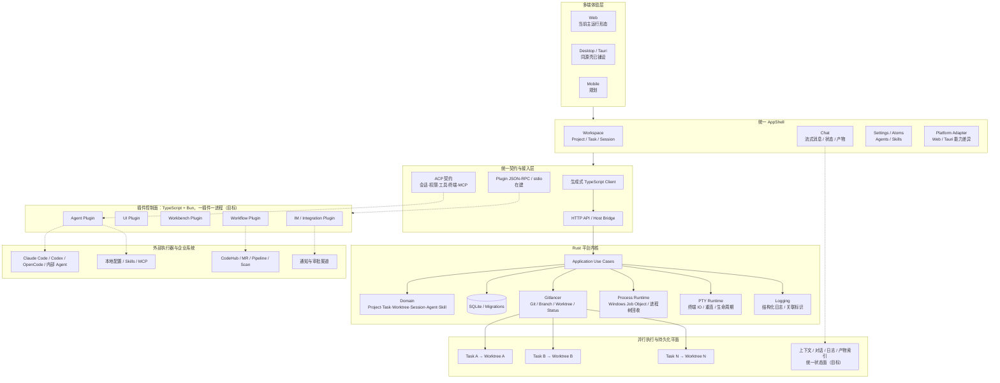
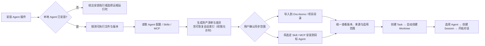
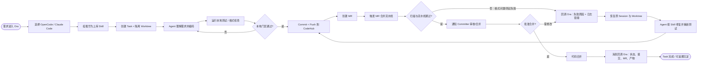

# Ora 领导演示 PPT 丰富版大纲

> 建议成稿：23 页，16:9，约 20–25 分钟。  
> 受众：业务与技术领导。  
> 汇报目标：让听众理解 Ora 不是“又一个 Agent”，而是连接异构 Agent、企业流程与隔离工作区的 AI Agent IDE，并支持启动聚焦试点。

## 一、汇报主线与表达口径

### 一句话结论

Ora 通过统一对象、统一协议、统一能力资产和统一执行工作区，把彼此割裂的 Agent 变成可管理、可切换、可并行、可闭环的企业研发生产系统。

### 叙事结构

1. **为什么必须做**：模型能力快速提升，但 Agent 孤岛、企业流程鸿沟、能力资产散乱和单工作区模式正在吞噬生产力。
2. **Ora 如何解题**：以 Project / Task / Session 为稳定主线，以插件连接异构 Agent，以 Contracts / ACP 统一语言，以 Worktree 支撑并行。
3. **代码基础是否可信**：Rust 分层内核、SQLite、生成式契约、Git/Worktree、Windows 进程树、PTY、Web/Tauri 同源壳和 ACP 数据模型已有基础。
4. **演示如何落地**：先演示 Agent/Skill/MCP 纳管，再演示“编码—测试—CodeHub—MR—流水线—修复—合并—回调”闭环。
5. **希望领导做什么**：批准聚焦试点，以 2 类 Agent、1 条华为上库工作流、1–2 个团队验证价值。

### 能力状态图例

- **实线 / 深色**：当前代码已有基础，可在演示中以真实能力或真实界面呈现。
- **渐变 / 中色**：接口与领域模型已铺设，运行链路仍在接通。
- **虚线 / 浅色**：目标能力或路线图，演示时应明确标注“在建/规划”，不要表述为已全面量产。

### 视觉建议

- 白底为主，Huawei Red `#C7000B` 只用于结论、关键路径和决策点；深蓝灰 `#1F2937` 承载技术主体。
- 成功使用绿色，处理中使用琥珀色，异常回路使用红色；不要用大面积渐变或霓虹紫。
- 中文字体优先 HarmonyOS Sans SC，兼容字体使用 Microsoft YaHei；页面标题不小于 30–34 pt，正文不小于 18 pt。
- 架构图和流程图统一使用“圆角矩形 + 直角连接线 + 明确箭头”；虚线仅表示规划或异步回调。
- 此处是“华为风格视觉建议”，若有正式内部模板，应以正式母版、色板、页脚和保密标识为准。

---

## 二、逐页大纲（23 页）

## P01｜Ora：面向 AI Agent 的 IDE

**本页任务**：用一句话建立产品定位。

**上屏文案**

- 副标题：把 Agent 从孤岛工具，升级为企业可编排的生产力平台
- Slogan：书同文 · 车同轨 · 万物皆可插件
- 页脚短句：Windows 先行｜Web + Desktop 同源｜Rust 内核｜TypeScript 插件生态

**视觉**：极简封面。中心是 Ora 标识，背景隐约出现三条并行“开发车道”，分别标注 Claude Code、Codex、OpenCode，最终汇入 Ora。

**口播建议**：我们不是再做一个更强的 Agent，而是在做让不同 Agent 真正进入企业生产流程的 IDE。

---

## P02｜我们要解决的，不是“缺一个更强的 Agent”

**本页任务**：先给领导结论，避免汇报陷入技术细节。

**上屏文案**

- Agent 已经足够多，真正短缺的是统一入口、统一上下文和统一交付链路。
- Ora 让 Agent 可替换，让任务、记忆、流程和产物留在平台中。
- 目标不是提升一次对话的效果，而是提升端到端研发吞吐。
- 本次希望验证：2 类 Agent + 1 条华为上库流程 + 1–2 个试点团队。

**视觉**：左侧“多个强大但割裂的大脑”，右侧“Ora 连接大脑、手脚与道路”；中间用粗箭头标注“从工具能力到组织产能”。

---

## P03｜AI 能力越强，协同摩擦反而越暴露

**本页任务**：总览问题，并为后续四页展开建立框架。

**上屏文案**

四个矛盾：

1. **Agent 孤岛**：多种 Agent 各有入口、配置、记忆与对话。
2. **流程鸿沟**：通用 Agent 会写代码，却不理解企业研发门禁。
3. **资产散乱**：Skill、MCP、配置散落在不同目录和不同工具中。
4. **并行受限**：原始 CLI 与单工作区让多任务互相争抢资源。

**视觉**：四个问题围绕一个中心断点“开发连续性被打断”，不要使用四张独立卡片堆砌；用四条裂缝汇入中心更有冲击力。

**收束句**：能力在增长，协同成本也在增长。

---

## P04｜Agent 越多，开发链路越容易被切碎

**本页任务**：讲清“Agent 孤岛”为什么不是简单的界面问题。

**上屏文案**

- Claude Code、Codex、OpenCode 等各自拥有安装、配置、权限和会话入口。
- 开发者在多个终端间复制需求、日志、代码片段和决策背景。
- 不同 Agent 对上下文、记忆和工具的表达方式不同，切换时需要重新翻译。
- 多个 Agent 共用一个目录容易相互覆盖；完全隔离又无法自然共享产物。
- 最终结果：开发者被迫充当 Agent 之间的“消息总线”和“文件搬运工”。

**视觉**：一条开发链路被三个 CLI 窗口切断，人在中间反复搬运剪贴板；底部用红色标注“开发连贯性被强制打断”。

**金句**：不是 Agent 不够聪明，而是它们生活在彼此隔绝的世界。

---

## P05｜企业系统越丰富，Agent 越难真正交付

**本页任务**：把“系统林立”和“流程鸿沟”合并为企业问题。

**上屏文案**

- 项目管理、代码托管、测试、流水线、扫描、评审和通知系统各有规则。
- 华为 IPD 语境、Spec 类型、角色职责和准入门禁不是通用模型的默认知识。
- Agent 可以完成局部编码，但往往停在“下一步请人工操作”。
- 人必须在多个系统中补录、建 MR、看流水线、解释失败并催促合入。
- 局部自动化很强，端到端交付仍然断裂。

**视觉**：左侧 Agent 输出代码，右侧是一串企业门禁，代码在第一个门禁处停住；人需要逐个开门。

**金句**：会写代码只是入场券，能走完整个研发流程才是生产力。

---

## P06｜Skill / MCP 正在成为新的“配置债务”

**本页任务**：把零散的个人配置上升为组织资产治理问题。

**上屏文案**

- 同一个能力在多个 Agent 中重复安装、重复配置、重复升级。
- Skill/MCP 的来源、版本、适用范围、权限和质量缺少统一视图。
- 本地目录结构不同，团队很难复用“别人已经调好的能力”。
- 缺少线上市场与本地状态的统一管理，无法回答“谁装了什么、是否可用”。
- 结果不是工具少，而是工具越多，管理成本越高。

**视觉**：不同 Agent 目录中散落的 Skill/MCP 逐渐形成“配置债务雪球”，右侧给出目标状态“一个资产目录、一套安装策略、一次配置多处使用”。

**收束句**：知识没有被产品化，就无法规模化复制。

---

## P07｜单工作区 + 原始 CLI，把并行产能锁死

**本页任务**：解释为什么 Worktree 和现代 UI 是生产力基础，而非“锦上添花”。

**上屏文案**

- 多个任务共用一个工作目录，会争抢分支、依赖、临时文件和未提交修改。
- 开发者不熟悉 Worktree 时，只能排队做任务，或复制整份仓库。
- CLI 适合单点操作，不适合同时观察多个 Task、Session、Agent 和流水线状态。
- 信息散落在滚动日志里，异常、权限、计划和产物缺少结构化展示。
- Token 供给再多，如果工作区不能并行，仍然转化不成吞吐。

**视觉**：上半部分是一条拥堵的单车道；下半部分是多条 Worktree 车道并行运行，每条车道有独立 Task 和 Agent。

**金句**：硬核不等于好用；Beauty does matter，尤其当人要管理多个 Agent 时。

---

## P08｜真正损失的是开发连续性与组织复用率

**本页任务**：把六类问题收束成领导关心的结果。

**上屏文案**

用一条“价值泄漏链”表达：

`模型能力 → Agent 执行 → 企业流程 → 代码合入 → 组织复用`

在每个箭头下标出泄漏点：

- 上下文重建
- 人工复制粘贴
- 系统间跳转
- 失败后人工解释
- Skill/MCP 重复配置
- 单工作区排队

**视觉**：漏斗或管道图。左侧输入“模型、Token、工具”，右侧输出“有效交付”，中间多处漏水。

**口播建议**：Ora 的商业价值不是让一个答案快几秒，而是减少每一次切换、等待、返工和重复配置。

---

## P09｜Ora 用“四个统一”把异构 Agent 变成一套生产系统

**本页任务**：给出解题总纲，并与后续架构一一对应。

**上屏文案**

1. **统一对象**：Project / Task / Worktree / Session / Agent / Skill。
2. **统一语言**：前后端 Contracts，Agent 对话与工具能力对齐 ACP。
3. **统一资产**：Agent 配置、Skill、MCP 进入平台级纳管与项目级分发。
4. **统一车道**：一 Task 一 Worktree，多 Agent、多 Session 并行工作。

外圈补充：**万物插件化**，连接 Agent、UI、Workbench、工作流和企业系统。

**视觉**：中心 Ora，四条同心轨道或四根支柱；不要使用普通四宫格。

**金句**：书同文、车同轨、统一度量衡，打造 Agent 的多智能体协同世界。

---

## P10｜Ora 不是聊天框，而是 AI Agent 的 IDE

**本页任务**：明确产品边界。

**上屏文案**

- 一个入口发现和选择不同 Agent。
- 一个工作空间承载 Project、Task、Session、对话和产物。
- 一个管理面统一管理 Agents、Skills，逐步扩展到 MCP 与配置策略。
- 一个执行面管理 Worktree、Git、进程、终端和日志。
- 一个插件面扩展 Agent、UI、Workbench、工作流和消息系统。

**不做什么**：不重新训练大模型，不替代现有 Agent，不再造一套封闭企业系统。

**视觉**：Ora 位于中间，左侧是用户与多端界面，右侧是各类 Agent，底部是工作区和企业系统。

---

## P11｜以任务为中心：Agent 可以换，工作不断档

**本页任务**：解释 Ora 的核心交互模型。

**上屏文案**

稳定主线：

`Project → Task → Worktree → Session → Agent`

- Project 保存长期工程上下文。
- Task 是可交付工作单元，并绑定隔离 Worktree。
- Session 记录某个 Agent 的一次运行和会话身份。
- Agent 是可替换执行器，而不是信息的唯一所有者。
- 对话、计划、权限、工具调用、日志和产物围绕 Task 聚合。

**视觉**：一条主干是 Project/Task/Worktree，多个 Agent 像可插拔引擎接入不同 Session；切换 Agent 时主干不变。

**金句**：换 Agent 像换浏览器引擎，不必更换操作系统。

---

## P12｜一 Task 一 Worktree，把并行从口号变成基础设施

**本页任务**：把 Worktree 讲成领导能理解的“开发车道”。

**上屏文案**

- 创建 Task 时自动创建 linked Worktree 和任务分支。
- 每个任务拥有独立目录，互不覆盖未提交修改与构建产物。
- 多个 Agent 可在不同任务车道并发工作。
- 删除 Task 时由后端回收任务工作区，避免长期目录污染。
- Git、进程和状态被平台统一观察，用户无需记忆复杂命令。

**视觉**：三条并行车道：需求 A/Codex、缺陷 B/Claude Code、重构 C/OpenCode。每条车道都有独立分支、工作区、会话和状态灯。

**代码事实提示（不建议上屏）**：当前代码已实现 Task 创建时 provision linked Worktree、冲突前缀规避、持久化失败补偿清理和删除时强制回收。

**金句**：创建 Worktree 像喝水一样简单——欢迎加入并行世界。

---

## P13｜Ora 应用架构：稳定内核承载快速变化的 Agent 生态

**本页任务**：用一张整页架构图证明方案可落地、可演进、可治理。

**架构图建议**

**PowerPoint 落图要求**

- 使用 6 条横向分层带，不把 crate 名直接堆满页面；技术名放在节点副标题。
- 左上角加图例：实线=当前基础，虚线=在建/规划。
- 右侧放一条纵向“企业治理”护栏：权限确认、进程隔离、审计日志、健康检查、配置策略。
- 最底层 Worktree 使用平行车道造型，强化产品记忆点。
- 图中所有箭头必须有明确方向，避免线穿过文字；复杂连接优先直角折线。

**口播建议**：上层是一套可复用体验，中间是 Rust 的稳定度量衡，插件层吸收 Agent 和企业系统的快速变化，底层以 Worktree 和进程隔离保证并行执行不互相污染。

---

## P14｜Rust 内核提供确定性，插件层提供扩展速度

**本页任务**：解释为什么采用“Rust Host + TypeScript/Bun Plugin”。

**上屏文案**

**Rust 内核负责稳定边界**

- 领域模型、应用用例、持久化与迁移
- Git/Worktree 生命周期与失败补偿
- 进程树、PTY、日志、健康检查
- 类型契约与跨端一致性

**TypeScript 插件负责变化边界**

- 快速适配不同 Agent 的安装、配置和会话协议
- 快速连接 UI、Workbench、工作流和企业系统
- Bun 管理插件依赖与运行时；一插件一进程控制故障半径

**视觉**：左右两块通过“稳定接口”咬合；左边像底座，右边像可替换模块。

**金句**：把变化隔离在插件里，把确定性沉淀在内核里。

---

## P15｜万物皆可插件化，能力边界可以持续外扩

**本页任务**：展示生态想象力，但避免过度承诺。

**上屏文案**

| 插件类型 | 主要职责 | 示例 |
|---|---|---|
| Agent Plugin | 发现、启动并适配 Agent，索引其配置与可恢复会话 | Claude Code、Codex、OpenCode、内部 Agent |
| UI Plugin | 扩展可视化与交互 | 评审面板、计划视图、资产浏览器 |
| Workbench Plugin | 提供专业工作台 | 调试、测试、代码审查、性能分析 |
| Workflow Plugin | 编排企业研发流程 | 华为 IPD/Spec、CodeHub 上库、MR、流水线、扫描、回调 |
| Integration Plugin | 连接消息与协作系统 | 通知、审批、人员协同 |

**底部彩蛋**：只要能力边界清晰，甚至可以把“找同事评审”封装为一个人机协同插件。

**视觉**：以 Ora 为插座，五类插件以不同形态接入；不要做应用商店图标墙。

---

## P16｜Contracts + ACP + Atoms，让所有 Agent 说同一种业务语言

**本页任务**：把协议、契约、资产管理翻译为领导能理解的统一度量衡。

**上屏文案**

- **Contracts**：Rust 定义前后端共享对象并生成 TypeScript Client，减少接口漂移。
- **ACP**：统一会话、流式消息、权限、工具调用、终端、文件和 MCP 的表达。
- **Atoms**：当前统一管理 Agent 与 Skill，后续扩展 MCP、配置模板、版本和分发策略。
- **Session 映射**：保留 Ora Session 与 Agent 自身 Session 的对应关系，便于继续对话和切换执行器。
- **结构化状态**：计划、消息、工具调用、错误和产物不再只是终端字符流。

**视觉**：三个不同语言的 Agent 先进入“ACP 翻译层”，再以同一种 Project/Task/Session 语言进入 Ora。

**金句**：书同文不是让 Agent 变得一样，而是让它们能够在同一套生产系统中协作。

---

## P17｜当前代码已形成骨架，演示能力按三档推进

**本页任务**：建立可信度，明确现状与路线图边界。

**上屏文案**

**A. 已有代码基础**

- Web Rust 服务、SQLite、Project/Task/Session/Agent/Skill 领域与 CRUD
- Task 自动创建/回收 linked Worktree，Gitlancer Git 能力
- Windows 进程树管理、PTY、结构化日志
- React AppShell、Web/Tauri 同源壳、Atoms 管理界面
- ACP 数据契约与流式对话状态管理

**B. 接口已铺设、运行链路在接通**

- 真实 ACP Transport 与 Agent 运行时对接
- Desktop 宿主与 Rust 能力的完整装配
- Plugin SDK 从 JSON-RPC 原型走向插件生命周期管理

**C. 演示目标 / 后续建设**

- 本地 Agent/Skill/MCP 自动发现、导入、安装与差异同步
- 插件市场、版本治理、签名与权限策略
- CodeHub/MR/流水线/消息回调闭环

**视觉**：三段式成熟度阶梯，避免使用百分比和虚构进度数字。

**口播建议**：今天展示的是清晰的产品方向和已经能支撑它的工程骨架；尚未接通的部分会明确标注，不把路线图包装成量产能力。

---

## P18｜两个场景，验证“能管理”与“能交付”

**本页任务**：给演示建立期待。

**上屏文案**

**场景 A：插件与 Agent 管理**

- 证明 Ora 能把本地 Agent、配置、Skill、MCP 变成可见、可控、可分发的资产。

**场景 B：华为开发上库闭环**

- 证明 Agent 不仅能编码，还能在 Ora 编排下走完 CodeHub、MR、流水线、修复、合并与回调。

**演示判断标准**

- 人是否减少了跨工具搬运？
- 失败是否能回到原 Session 自动修复？
- 任务、状态、日志和产物是否留在同一上下文？

**视觉**：一条从“纳管能力”到“闭环交付”的上升曲线，场景 A 是起点，场景 B 是终点。

---

## P19｜场景 A：安装一个插件，接管一个 Agent 世界

**本页任务**：展示插件和资产管理的用户旅程。

**演示流程图**

**建议现场动作**

1. 在 Settings / Atoms 中查看已有 Agent 与 Skill。
2. 安装 OpenCode 或 Claude Code 插件。
3. 展示“发现结果”：路径、版本、配置、Skill、MCP。
4. 选择一个华为开发 Skill，执行“导入到项目”或“安装到 Agent”。
5. 创建 Task，展示独立 Worktree。
6. 选择 Agent 创建 Session，并发出第一条指令。

**异常分支**：若 Agent 未安装、Skill 冲突或 MCP 需要额外权限，Ora 应展示原因、影响范围和可恢复动作，而不是静默失败。

**口播建议**：过去是人记住每个 Agent 的目录；现在由插件理解差异，Ora 提供统一视图。

---

## P20｜场景 B：Skill 驱动“编码到合入”的自动驾驶

**本页任务**：用整页主流程图展示华为开发上库闭环，必须突出失败回路。

**主流程图**

**图形要求**

- 主链路使用深蓝灰，成功链路使用绿色，失败回路使用 Huawei Red。
- “回调 Ora → 恢复原 Session/Worktree → Agent 修复 → 重新 Push”必须形成醒目的闭环箭头。
- 人工决策点只保留“确认需求”和“Committer 合并”，突出人从操作员变为决策者。
- CodeHub 首次出现时标注“华为内部代码托管”；MR 首次出现时标注“类似 Pull Request”。

**金句**：人负责意图与决策，Ora 负责上下文与编排，Agent 负责执行，平台门禁负责质量。

---

## P21｜失败不是终点，而是回到原上下文继续执行

**本页任务**：用泳道图说明四方职责，并证明流程符合真实研发逻辑。

**四泳道设计**

| 阶段 | 开发者 / Committer | Ora | Agent 插件 | CodeHub / 流水线 |
|---|---|---|---|---|
| 任务启动 | 提需求、选择 Agent、确认 Skill | 创建 Task/Worktree，加载上下文 | 启动或恢复 Agent Session | — |
| 编码与本地门禁 | 查看计划，必要时确认 | 展示计划、日志、权限与状态 | 编码、测试、格式检查 | — |
| 提交与建 MR | 可选审阅变更 | 编排 Git/工作流并记录产物 | Commit、Push、创建 MR | 接收代码、创建 MR |
| 流水线失败 | 不需要复制日志 | 接收回调，将失败绑定原 Task/Session | 读取日志，按 Skill 修复并重推 | 扫描、失败、重跑 |
| 合并决策 | Committer 审核并批准 | 通知、等待、保持状态 | 按反馈继续修改 | 合并门禁与代码合并 |
| 闭环沉淀 | 查看结果 | 回写状态、提交、MR、日志和产物 | 结束 Session 或待命 | 发送最终回调 |

**视觉**：PowerPoint 中绘制真正的四泳道流程，不直接把表格当最终成稿。纵向为四个角色，横向为六个阶段；异常回路从流水线泳道返回 Ora，再返回 Agent，不直接跳到人。

**强调点**

- 回调必须携带可定位信息：项目、Task、MR、提交、流水线、失败类型和日志地址。
- 修复必须在同一个 Worktree/Session 上下文中继续，避免重新解释需求。
- 合并必须保留人工门禁，自动化不绕过组织责任边界。

---

## P22｜Ora 的价值要用研发结果衡量，而不是用对话次数衡量

**本页任务**：给出可执行的试点评价体系，不虚构收益数字。

**上屏文案**

建议试点采集 6 组指标，并先建立基线：

1. **连续性**：每个 Task 的跨工具切换次数、人工复制粘贴次数。
2. **交付效率**：从需求进入到 MR 创建、从 MR 创建到合入的周期。
3. **自动闭环率**：流水线失败后无需人工搬运日志即可完成修复的比例。
4. **并行度**：同时运行的独立 Task/Worktree 数，以及互相污染事件数。
5. **资产复用**：Skill/MCP 的复用次数、重复配置时间、版本一致率。
6. **质量与治理**：本地门禁通过率、MR 一次通过率、权限确认与审计完整率。

**视觉**：不要放虚构的增长百分比。使用“基线 → 试点 → 目标”的三阶段测量框架，右侧标注“以数据决定扩面”。

**领导翻译**：我们最终优化的是交付周期、失败恢复和组织复用，不是让员工多开几个聊天窗口。

---

## P23｜先跑通一条闭环，再复制成企业级 Agent 生产线

**本页任务**：形成明确的决策请求，不能以泛泛的“谢谢”结束。

**上屏文案**

**建议的三阶段路线**

1. **跑通底座**：真实 ACP Transport、插件生命周期、Agent 发现与会话接入。
2. **跑通闭环**：OpenCode + Claude Code、华为上库 Skill、CodeHub/MR/流水线回调。
3. **形成平台**：插件市场、Skill/MCP 治理、权限/签名、更多 Workbench 与工作流。

**本次申请的支持**

- 选择 1–2 个真实项目作为试点，并提供典型上库流程样本。
- 协调 CodeHub、流水线与消息回调的联调接口和测试环境。
- 明确安全、权限、插件签名和数据边界的责任人。
- 以 P22 指标复盘试点，达标后再扩展 Agent 和团队范围。

**结束金句**

> 我们不是再做一个 Agent；我们在建设一套让 Agent、流程与人协同交付的 IDE。

**视觉**：底部是一条由单条试点车道逐渐扩展成多车道网络的路线图；右上角用红色强调“决策：批准聚焦试点”。

---

## 三、架构与演示制作注意事项（非上屏内容）

### 1. 必须避免的过度表述

- 不要说“所有 Agent 已经自动发现并完全接入”。当前代码中的 Agent/Skill 已有领域模型、CRUD 和 UI，但真实本地探测与安装分发仍属于在建/演示目标。
- 不要说“ACP 生产链路已全面打通”。当前已有 ACP 契约和流式聊天状态，Web 真实运行态仍使用 unavailable transport；Mock 模式有可演示链路。
- 不要说“插件系统已经成熟”。当前 Plugin SDK 是 JSON-RPC/stdin/stdout 的早期原型，完整插件清单、生命周期、隔离、签名和市场仍需建设。
- 不要把 Mobile 表述为现有客户端；应写“同源演进方向/规划”。
- 不要把 CodeHub/MR/流水线自动化表述为已经量产；应写“目标演示闭环”或“试点建设范围”。

### 2. 演示前建议准备的素材

- Ora Web/桌面壳的真实截图：Workspace 树、Task/Session、Chat、Settings/Atoms。
- 创建 Task 前后，仓库中 linked Worktree 的对比画面。
- Agent/Skill 列表的真实数据；MCP 用“规划列”或 Demo 数据明确标识。
- 一次流水线格式失败的真实或脱敏日志，确保失败类型可被 Agent 修复。
- CodeHub MR 页面的脱敏截图或沙箱环境，避免现场依赖不可控网络。
- 一条预先验证的成功路径和一条预先验证的失败回路。

### 3. 推荐演示节奏

- 0–7 分钟：困境与 Ora 解题思路（P01–P10）。
- 7–13 分钟：产品模型与架构（P11–P17）。
- 13–21 分钟：两个现场场景（P18–P21）。
- 21–25 分钟：价值衡量与试点决策（P22–P23）。

### 4. 代码事实来源

- `crates/domain`：Project、Task、Worktree、Session、AgentDefinition、Skill 等领域模型。
- `crates/application`：领域用例、Repository Port、Task/Worktree 生命周期与补偿逻辑。
- `crates/contracts` 与 `packages/contracts`：Rust 契约、ACP 类型与生成的 TypeScript Client。
- `crates/gitlancer`：Git CLI、Branch、Commit、Status、Worktree 的类型化能力。
- `crates/process`：跨平台子进程抽象及 Windows Job Object 进程树管理。
- `crates/pty`：PTY 生命周期、输入输出、重连回放和退出管理。
- `crates/db`、`crates/logging`：SQLite 迁移/Repository 与结构化日志。
- `packages/app-shell`、`packages/chat`、`packages/platform`：统一前端壳、流式会话状态与 Web/Tauri 平台适配。
- `apps/web`、`apps/desktop`：Web 运行态与 Tauri 桌面壳。
- `packages/plugin-sdk`：当前 JSON-RPC/stdin/stdout 插件 SDK 原型。
